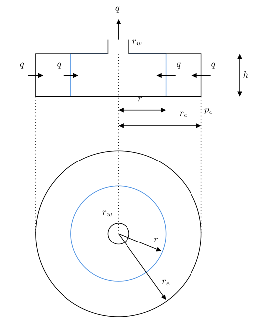

# Стационарные решения уравнения фильтрации

Широкое распространение на практике получили стационарные решения уравнения фильтрации. Приведем некоторые из них.

## Радиальный приток. Решение для постоянного давления на круговой границе. 

Рассматривается самая простая модель работы добывающей скважины - радиальная стационарная фильтрация в однородном изотропном пласте круговой формы. Скважина находится в центре пласта (@fig-radial_inflow_steady_state_1). На границе пласта поддерживается постоянное давление. Фактически это означает, что через границу пласта идет поток жидкости, уравновешивающий дебит скважины.

Решение можно получить как решения уравнения фильтрации, учитывая стационарность потока

$$  
    \frac{\partial ^2 p }{\partial r^2} + \frac{1}{r} \frac{\partial p}{\partial r} = 0
$$ {#eq-diff_eq_10}


{#fig-radial_inflow_steady_state_1 width=40%}


Или можно получить его непосредственно из закона Дарси, который должен быть приведен к радиальной форме и в таком варианте известен как Формула Дюпюи. Для приведенной конфигурации можно записать закон Дарси в форме.

$$
u_r=\frac{q}{2\pi rh}=\frac{k}{\mu}\frac{dP}{dr}
$$

Проинтегрировав выражение по замкнутому контуру радиуса $r_e$ вокруг скважины получим выражение известное как формула Дюпюи.


::: callout-tip
## Уравнение Дюпюи
$$ 
q=\frac{2\pi kh\left(P_e-P_w\right)}{\mu\left(\ln{\dfrac{r_e}{r_w}}\right)}
$$ {#eq-dupui_1}
:::

В приведенном выражения использованы единицы СИ.

Здесь

-   $u_r$ - приведенная скорость фильтрации на расстоянии $r$ от скважины, м/с
-   $q$ - объемные дебит скважины в рабочих условиях, м^3^/с
-   $r$ - радиус - расстояние от центра скважины, м
-   $r_e$ - радиус зоны дренирования, на котором поддерживается постоянное давление, м
-   $r_w$ - радиус скважины, на котором замеряется забойное давление, м
-   $P$ - давление, Па
-   $P_e$ - давление на внешнем контуре дренирования, Па
-   $P_w$ - давление на забое скважины, Па
-   $k$ - проницаемость, м^2^
-   $\mu$ - вязкость нефти в зоне дренирования, Па с

Стационарное решение в безразмерных переменных примет вид 
$$
p_D =  q_D \ln \frac{r_{eD}}{r_D} 
$$ {#eq-steadystate_dimensionless_1}

На практике часто бывает удобнее пользоваться значениями в практических метрических единицах измерения.

::: callout-tip
## Уравнение Дюпюи в практических метрических единицах
$$
q=\frac{kh\left(P_e-P_w\right)}{ 18.42 \mu\left(\ln{\dfrac{r_e}{r_w}}\right)}
$$ {#eq-dupui_2}
:::

где

-   $q$ - объемные дебит скважины в рабочих условиях, м^3^/сут
-   $r$ - радиус - расстояние от центра скважины, м
-   $r_e$ - радиус зоны дренирования, на котором поддерживается постоянное давление, м
-   $r_w$ - радиус скважины, на котором замеряется забойное давление, м
-   $P$ - давление, атм
-   $P_e$ - давление на внешнем контуре дренирования, атм
-   $P_w$ - давление на забое скважины, атм
-   $k$ - проницаемость, мД
-   $\mu$ - вязкость нефти в зоне дренирования, сП

Далее если не указано особо будем использовать практические метрические единицы.

## Формула Дюпюи с учетом скин-фактора

Решение для задачи стационарного притока к вертикальной скважине в однородном изотропном пласте круговой формы с постоянным давлением на границе имеет вид

$$
Q=\dfrac{kh}{18.42\mu B} \dfrac{P_{res}-P_{wf}}{\ln \dfrac{r_e}{r_w} + S}
$$ {#eq-dupui_skin_1}

где 

- $Q$ - дебит скважины на поверхности, приведенный к нормальным условиям, ст. м$^3$/сут
- $\mu$ - вязкость нефти в пласте, сП
- $B$ - объемный коэффициент нефти, м$^3$/м$^3$
- $P_{res}$ - пластовое давление или давление на контуре с радиусом $r_e$, атма
- $P_{wf}$ - давление забойное, атма
- $k$ - проницаемость, мД
- $h$ - мощность пласта, м
- $r_e$ - внешний контур дренирования скважины, м
- $r_w$ - радиус скважины, м
- $S$ - скин-фактор скважины, м

Это решение известно как [закон Дарси](https://ru.wikipedia.org/wiki/%D0%97%D0%B0%D0%BA%D0%BE%D0%BD_%D0%94%D0%B0%D1%80%D1%81%D0%B8) или [формула Дюпюи](https://ru.wikipedia.org/wiki/%D0%9F%D1%80%D0%BE%D0%B4%D1%83%D0%BA%D1%82%D0%B8%D0%B2%D0%BD%D0%BE%D1%81%D1%82%D1%8C_(%D0%BD%D0%B5%D1%84%D1%82%D0%B5%D0%B4%D0%BE%D0%B1%D1%8B%D1%87%D0%B0)).

Выражение (-@eq-dupui_skin_1) можно переписать в виде для расчета давления в любой точке пласта опираясь на давление на контуре в виде

$$
P_{r} = \begin{cases}
         P_{res} - 18.42\dfrac{ Q\mu B }{kh} \left[ \ln\dfrac{r_e}{r} \right] & \text{, } r_e > r > r_w \\[10pt]
         P_{res} - 18.42\dfrac{ Q\mu B }{kh} \left[ \ln\dfrac{r_e}{r} + S\right]  & \text{, } r = r_w
\end{cases} 
$$ {#eq-p_dupui_skin_1}

Выражение (-@eq-p_dupui_skin_1) удобно для расчета распределения давления в пласте $P_r$ на произвольном расстоянии от скважины $r$. Здесь задано граничное значение давления $p_{res}$ на контуре $r_e$. Расчет позволит найти любое значение внутри контура, в том числе и забойное давление $P_{wf}$ на $r=r_w$. Обратите внимание, что при расчете забойного давления необходимо учесть значение скин-фактора.


Также выражение (-@eq-p_dupui_skin_1) можно переписать в виде

$$
P_{r} = \begin{cases}
    P_{wf} + 18.42 \dfrac{ Q\mu B }{kh} [ \ln \dfrac{r}{ r_w } + S ] & \text{, } r_e > r > r_w \\[10pt]
    P_{wf}  & \text{, } r = r_w \\[10pt]
\end{cases}
$$ {#eq-p_dupui_skin_2}

где по известному дебиту и забойному давлению можно найти давление в пласте. При известном пластовом давлении можно оценить радиус контура на котором оно достигается.

при отрицательном скин факторе для проведения расчетов необходимо модифицировать выражения (-@eq-p_dupui_skin_1) и (-@eq-p_dupui_skin_2) используя приведенный радиус скважины $r_{wa} = r_w e^{-S}$
$$
P_{r} = \begin{cases}
         P_{res} - 18.42\dfrac{ Q\mu B }{kh} \left[ \ln\dfrac{r_e}{r} \right] & \text{если } S<0  \text{ и } r > r_w e^{-S} \\[10pt]
         P_{res} - 18.42\dfrac{ Q\mu B }{kh} \left[ \ln\dfrac{r_e}{r_w} + S \right]  & \text{если } S<0  \text{ и } r \le r_w e^{-S}
\end{cases} 
$$ {#eq-p_dupui_skin_1_1}


$$
P_{r} = \begin{cases}
    P_{wf} + 18.42 \dfrac{ Q\mu B }{kh} \left[ \ln \dfrac{r}{ r_w } + S \right] & \text{если } S<0  \text{ и } r > r_w e^{-S} \\[10pt]
    P_{wf}  & \text{если } S<0  \text{ и } r \le r_w e^{-S} \\[10pt]
\end{cases} 
$$ {#eq-p_dupui_skin_2_1}

Построим графики функций распределения давления для стационарного решения. Для этого определим расчетные функции для стационарного перепада давления и давления в зоне дренерирования с учетом скин-фактора.

```{python}
#| code-fold: false
#| echo: true
import numpy as np
import matplotlib.pyplot as plt

# Определим функции для расчета стационарного решения
def dp_ss_atm(q_liq_sm3day = 50,
              mu_cP = 1,
              b_m3m3 = 1.2,
              kh_mDm = 40,
              r_e_m = 240,
              r_w_m = 0.1,
              r_m = 0.1, 
              skin = 0):
  """
  Функция расчета перепада давления в произвольной точке пласта 
  на расстоянии r_m от центра скважины для стационарного решения
 
  - q_liq_sm3day - дебит жидкости на поверхности в стандартных условиях
  - mu_cP - вязкость нефти (в пластовых условиях)
  - B_m3m3 - объемный коэффициент нефти 
  - kh_mDm - kh пласта
  - r_e_m - радиус контрура питания, м  
  - r_w_m - радиус скважины, м
  - r_m - расстояние на котором проводится расчет, м
  - skin - скин фактор
  """
  r_eff_m = np.where(skin < 0, r_w_m * np.exp(-skin), r_w_m)
  mult = 18.42 * q_liq_sm3day * mu_cP * b_m3m3/ kh_mDm
  dp = np.where(r_m <= r_eff_m, 
                mult * (np.log(r_e_m/r_w_m) + skin),
                mult * (np.log(r_e_m/r_m)))

  return dp

def p_ss_atma(p_res_atma = 250,
              q_liq_sm3day = 50,
              mu_cP = 1,
              b_m3m3 = 1.2,
              k_mD = 40,
              h_m = 10,
              r_e_m = 240,
              r_w_m = 0.1,
              r_m = 0.1, 
              skin = 0):
  """
  функция расчета давления в произвольной точке пласта 
  на расстоянии r_m от центра скважины для стационарного решения 

  - p_res_atma - пластовое давление, давление на контуре питания
  - q_liq_sm3day - дебит жидкости на поверхности в стандартных условиях
  - mu_cP - вязкость нефти (в пластовых условиях)
  - B_m3m3 - объемный коэффициент нефти 
  - k_mD - проницаемость пласта
  - h_m - мощность пласта, м
  - r_e_m - радиус контрура питания, м  
  - r_m - расстояние на котором проводится расчет, м
  """
  return p_res_atma - dp_ss_atm(q_liq_sm3day = q_liq_sm3day,
                                mu_cP = mu_cP,
                                b_m3m3 = b_m3m3,
                                kh_mDm = k_mD * h_m,
                                r_e_m = r_e_m,
                                r_w_m = r_w_m,
                                r_m = r_m,
                                skin = skin)
```

```{python}
#| label: fig-steady_state_press_distributions
#| fig-cap: "Распределение давления для различных значений скин-фактора"
#| fig-subcap:
#|   - "S = 3"
#|   - "S = 0"
#|   - "S = -3"
#| layout-ncol: 3
"""
Построим график распределения давления в пласте
"""
from matplotlib.ticker import ScalarFormatter
# формируем массив расстояний для которых будем проводить расчет
r_arr = np.logspace(np.log10(0.1),np.log10(250), 500) 
pmin = 250


for skin in [3, 0, -3]:
    fig, (ax1, ax2) = plt.subplots(2, 1, figsize=(3,7))
    # рассчитываем массив давлений на соответствующих расстояниях
    # для расчета используется векторный расчет numpy - нет необходимости делать цикл в явном виде
    # для примера показана передача всех аргументов созданной функции
    p_arr = p_ss_atma(p_res_atma=250, q_liq_sm3day=50,
                    mu_cP=1, b_m3m3=1.2,
                    k_mD=40, h_m=10,
                    r_e_m=240, r_w_m = 0.1, r_m=r_arr, 
                    skin = skin)
    if np.min(p_arr) < pmin:
        pmin = np.min(p_arr)
    # рисуем график в обычных координатах
    ax1.plot(r_arr, p_arr)   # команда отрисовки графика по заданным массивам
    ax1.plot(-r_arr, p_arr)
    # настраиваем график
    ax1.set_title(f'S={skin}')
    #ax1.set_xlabel('r, m')
    ax1.set_ylabel('p, atma')
    ax1.set_ylim(pmin, 250)
    # рисуем график в логарифмических координатах
    ax2.plot(r_arr, p_arr)   # команда отрисовки графика по заданным массивам
    ax2.plot(-r_arr, p_arr) 
    # настраиваем график
    ax2.set_title(f'S={skin}')
    ax2.set_xlabel('r, m')
    ax2.set_ylabel('p, atma')
    ax2.set_ylim(pmin, 250)
    ax2.set_xscale('symlog', linthresh=0.1, linscale=0.6)
    ax2.set_xticks([-100,-1, 1, 100])
    ax2.get_xaxis().set_major_formatter(ScalarFormatter())
    #fig.suptitle(f'S={skin}')
    plt.show()
```

### Формула Дюпюи с учетом скин-фактора в безразмерных переменных

Используя определения безразмерных переменных введенных ранее уравнение Дюпюи можно записать в виде


$$
q_D = \frac{p_{wD}}{\ln r_{eD} + S}
$$ {#eq-pd_dupui_d}

где

- $r_{eD}$ - безразмерный радиус контура
- $p_{wD}$ - безразмерное забойное давление

Выражение (-@eq-pd_dupui_d) позволяет оценить безразмерный дебит скважины по берзразмерному перепаду давления в зоне дренирования и безразмерному радиусу зоны дренирования.

Выражение для безразмерного давления в произвольной точке области дренирования на расстоянии $r_D$ можно записать в виде:
$$
P_{D} = \begin{cases}
    q_D\ln \dfrac{ r_{eD}}{ r_{D}}  & \text{если } r_{eD} \ge r_D > 1 \\[10pt]
    q_D(\ln r_{eD} + S)  & \text{если } r_D = 1 \\[10pt]
\end{cases} 
$$ {#eq-pd_dupui_skin}


## Среднее давление в области дренирования

Оценим среднее давление в области дренирования 

$$
P = \frac{1}{\pi (r_e^2-r_w^2)} \int\limits_{r_w}^{r_e} 2 \pi r p(r) dr 
$$


```{python}
#| label: fig-steady_state_press_distributions_with_average
#| fig-cap: "Распределение давления с оценкой среднего давления"

import scipy
# оценим среднее давление в области дренирования
r_external_m = 240
r_well_m = 0.1
p_average_atma = scipy.integrate.quad(lambda r:p_ss_atma(p_res_atma=250,
                                                         q_liq_sm3day=50,
                                                         mu_cP=1,
                                                         b_m3m3=1.2,
                                                         k_mD=40,
                                                         h_m=10,
                                                         r_e_m=r_external_m,
                                                         r_m=r)*2*r, 
                                      r_well_m, 
                                      r_external_m)[0]/(r_external_m**2-r_well_m**2) 

r_arr = np.linspace(r_well_m, r_external_m, 500)
r_full = np.linspace(-r_external_m, r_external_m, 10) 

# рассчитываем массив давлений на соответствующих расстояниях
# для расчета используется векторный расчет numpy 
# для примера показана передача всех аргументов созданной функции
p_arr = p_ss_atma(p_res_atma=250,
                  q_liq_sm3day=50,
                  mu_cP=1,
                  b_m3m3=1.2,
                  k_mD=40,
                  h_m=10,
                  r_e_m=r_external_m,
                  r_m=r_arr)

fig, (ax1, ax2) = plt.subplots(2, 1, figsize=(8,8))

fig.suptitle(f"Среднее давление в области дренирования p_average_atma = {p_average_atma}")
# рисуем график в обычных координатах
ax1.plot(r_arr, p_arr)   # команда отрисовки графика по заданным массивам
ax1.plot(-r_arr, p_arr)
ax1.plot(r_full, np.full_like(r_full, p_average_atma), linestyle='dashed')
# настраиваем график
ax1.set_ylabel('p, atma')

# рисуем график в логарифмических координатах
ax2.plot(r_arr, p_arr)   # команда отрисовки графика по заданным массивам
ax2.plot(-r_arr, p_arr) 
ax2.plot(r_full, np.full_like(r_full, p_average_atma), linestyle='dashed')
# настраиваем график
ax2.set_xlabel('r, m')
ax2.set_ylabel('p, atma')
ax2.set_xscale('symlog', linthresh=0.1, linscale=0.6)
plt.show()
```


Надо бы дополнить раздел. Показать как учет среднего давления превращается в $\frac{1}{2}$ в формуле Дюпюи

Хорошо бы привести пример расчета карты давления - воронки депрессии для стац случая

### Псевдоустановившийся режим притока

Тут надо бы показать как появляется $\frac{3}{4}$ для среднего давления и псевдоустановившегося режима

## Суперпозиция в пространстве для стационарного решения

**Принцип суперпозиции:**

Для системы из $N$ скважин суммарное давление в точке $(x, y)$ определяется как алгебраическая сумма давлений от каждой скважины:

$$
p(x, y) = p_e - \frac{\mu}{2 \pi k h} \sum_{i=1}^{N} Q_i \ln \frac{r_e}{r_i}
$$

где $r_i = \sqrt{(x - x_i)^2 + (y - y_i)^2}$ — расстояние до $i$-ой скважины.

### Теоретическая постановка задачи

На стационарном режиме при фильтрации жидкости  распределение давления в однородном пласте описывается формулой Дюпюи:

$$
p(r) = p_e - \frac{Q \mu}{2 \pi k h} \ln \frac{r_e}{r}
$$

где:
- $p_e$ — давление на контуре питания (Па)
- $Q$ — дебит скважины (м³/с), $Q>0$ для добывающих, $Q<0$ для нагнетательных
- $\mu$ — вязкость флюида (Па·с)
- $k$ — проницаемость пласта (м²)
- $h$ — эффективная толщина пласта (м)
- $r$ — расстояние от скважины (м)
- $r_e$ — радиус контура питания (м)

Примечание: радиусом контура питания принято считать расстояние от скважины до точки пласта, в которой изменение давления пренебрежимо мало. 


::: {.callout-note}
Чтобы выражение для принципа суперпозиции было применимо необходимо, чтобы расстояние между скважинами значительно превышало их радиусы ($r_i \gg r_w$).
:::

### Построение карты давления для произвольной группы скважин


```{python}
import numpy as np
import matplotlib.pyplot as plt
from matplotlib import cm
import matplotlib.colors as mcolors

# Параметры пласта
k = 1e-13      # проницаемость, м² (100 мД)
h = 10.0       # толщина пласта, м
mu = 1e-3      # вязкость, Па·с (1 сП)
p_e = 20e6     # давление на контуре, Па (20 МПа)
r_e = 1000.0   # радиус контура питания, м

# Скважины: [x, y, Q] — Q>0 добывающие, Q<0 нагнетательные
wells = np.array([
    [200, 300,  0.002],   # добывающая
    [600, 400,  0.0015],  # добывающая
    [400, 600, -0.001],   # нагнетательная
    [300, 700,  0.0018],  # добывающая
    [700, 700,  0.0022]   # добывающая
])

# Создание сетки
x = np.linspace(0, 1000, 200)
y = np.linspace(0, 1000, 200)
X, Y = np.meshgrid(x, y)

# Расчет давления по принципу суперпозиции
P = np.full_like(X, p_e)

for wx, wy, Q in wells:
    r = np.sqrt((X - wx)**2 + (Y - wy)**2)
    # Защита от деления на ноль и логарифма от нуля
    r = np.maximum(r, 0.1)
    P -= (Q * mu) / (2 * np.pi * k * h) * np.log(r_e / r)

# Визуализация
fig, ax = plt.subplots(figsize=(10, 8))
levels = np.linspace(P.min(), P.max(), 25)

# Контурные линии давления
contour = ax.contourf(X, Y, P/1e6, levels=levels/1e6, cmap='viridis')
cbar = fig.colorbar(contour, ax=ax, label='Давление, МПа')

# Линии одинакового давления
ax.contour(X, Y, P/1e6, levels=levels[::3]/1e6, colors='white', 
           linewidths=0.3, alpha=0.5)

# Отображение скважин
prod_wells = wells[wells[:, 2] > 0]
inj_wells = wells[wells[:, 2] < 0]

ax.scatter(prod_wells[:, 0], prod_wells[:, 1], 
           s=200, c='red', marker='o', edgecolors='darkred', 
           linewidths=2, label='Добывающие', zorder=5)
ax.scatter(inj_wells[:, 0], inj_wells[:, 1], 
           s=200, c='blue', marker='^', edgecolors='darkblue', 
           linewidths=2, label='Нагнетательные', zorder=5)

# Подписи скважин
for i, (wx, wy, Q) in enumerate(wells):
    label = f'W{i+1}\nQ={Q*86400:.2f} м³/сут'  # конвертация в м³/сут
    ax.annotate(label, (wx, wy), xytext=(15, 15), 
                textcoords='offset points', fontsize=9,
                bbox=dict(boxstyle='round,pad=0.3', facecolor='yellow', alpha=0.7))

ax.set_xlabel('X, м')
ax.set_ylabel('Y, м')
ax.set_title('Карта распределения давления для группы скважин\n(принцип суперпозиции)')
ax.legend(loc='upper right')
ax.grid(True, alpha=0.3)
ax.set_aspect('equal')
plt.tight_layout()
plt.show()


```


**Анализ результатов**

На карте видны:
- **Зоны депрессии** (низкое давление) вокруг добывающих скважин (красные круги)
- **Зоны репрессии** (повышенное давление) вокруг нагнетательной скважины (синий треугольник)
- **Интерференция скважин**: искажение изобар в областях пересечения зон влияния
- **Градиенты давления** определяют направление фильтрационных потоков


### Особенности галереи скважин
Галлерея скважин - группа скважин, находящихся на одной линии, дебит которых подбирается, таким образом, чтобы было одинаковое забойное с учётом интерференции всех скважин. Галлереи скважин используют в моделировании пластовых систем для создании границ, трещин и горизонтальных скважин. 

1. **Равномерное распределение депрессии** вдоль линии галереи при одинаковых дебитах
2. **Максимальная интерференция** между соседними скважинами — давление в промежутках выше, чем у одиночной скважины
3. **Эффективность охвата** — галерея создает «фронт» пониженного давления, вытесняющий флюид в направлении, перпендикулярном линии галереи
4. **Оптимальное расстояние** между скважинами определяется из условия: $ \sigma \approx 2\pi r_c $, где $r_c$ — радиус контура питания единичной скважины

```{python}
import numpy as np
import plotly.graph_objects as go
from plotly.subplots import make_subplots
from scipy.special import expi


k_m2 = 5e-15          # проницаемость, м²
thickness_m = 10       # толщина, м
porosity = 0.2         # пористость
compressibility = 1e-9 # сжимаемость, 1/Па
mu_eff = 1.0e-3        # вязкость, Па·с
B = 1.0                # объёмный коэффициент (для упрощения)
pwf_atm = 200.0        # забойное давление, атм
initial_pressure = 250.0  # начальное давление, атм
atm_to_pa = 101325
days_to_seconds = 86400

# Горизонтальная скважина
L = 300.0              # длина, м
N_seg = 15             # число сегментов
dx = L / N_seg
x_seg = np.linspace(-L/2 + dx/2, L/2 - dx/2, N_seg)
rw_eq = 0.28 * dx      # эффективный радиус сегмента

# Временные точки
time_points = np.logspace(-2, 3, 12)  # от 0.01 до 1000 сут
time_seconds = time_points * days_to_seconds

# Сетка для карты давления
x_plot = np.linspace(-600, 600, 60)
y_plot = np.linspace(-600, 600, 60)
X, Y = np.meshgrid(x_plot, y_plot)

eta = k_m2 / (porosity * mu_eff * compressibility)  # м²/с

all_q = []      # дебиты сегментов (м³/сут)
all_P = []      # поля давления (атм)

for t_sec in time_seconds:
    A = np.zeros((N_seg, N_seg))
    for i in range(N_seg):
        for j in range(N_seg):
            r2 = rw_eq**2 if i == j else (x_seg[i] - x_seg[j])**2
            u = r2 / (4 * eta * t_sec + 1e-30)
            A[i, j] = -expi(-u)  # ядро Ei
    
    # Правая часть: Δp = p_i - p_wf (в Па)
    dp_pa = (initial_pressure - pwf_atm) * atm_to_pa
    # Константа из решения уравнения
    C = (4 * np.pi * k_m2 * thickness_m / (mu_eff * B)) * dp_pa
    
    try:
        q_m3_per_sec = np.linalg.solve(A, np.full(N_seg, (4 * np.pi * k_m2 * thickness_m / (mu_eff * B)) * dp_pa))
        q_m3_per_day = q_m3_per_sec * days_to_seconds
    except:
        q_m3_per_day = np.full(N_seg, np.nan)
    
    all_q.append(q_m3_per_day)
    
    # === 2. Расчёт поля давления ===
    P_pa = np.full_like(X, initial_pressure * atm_to_pa, dtype=np.float64)
    
    for j in range(N_seg):
        if np.isnan(q_m3_per_day[j]):
            continue
        q_j = q_m3_per_day[j] / days_to_seconds  # м³/с
        r2 = (X - x_seg[j])**2 + Y**2
        u = r2 / (4 * eta * t_sec + 1e-30)
        dp_local = (q_j * mu_eff * B / (4 * np.pi * k_m2 * thickness_m)) * (-expi(-u))
        P_pa -= dp_local
    
    P_atm = P_pa / atm_to_pa
    all_P.append(P_atm)
    


fig = make_subplots(
    rows=2, cols=1,
    subplot_titles=("Профиль притока вдоль горизонтальной скважины", "Карта давления в пласте"),
    vertical_spacing=0.1,
    row_heights=[0.4, 0.6]
)


colors = ['red', 'blue', 'green', 'orange', 'purple', 'brown', 'pink', 'gray', 'olive', 'cyan', 'magenta', 'yellow']


for idx, t in enumerate(time_points):
    q = all_q[idx]
    P = all_P[idx]
    color = colors[idx % len(colors)]
    
   
    fig.add_trace(
        go.Scatter(
            x=x_seg,
            y=q,
            mode='lines+markers',
            name=f'Приток, t={t:.1f} сут',
            line=dict(color=color),
            marker=dict(size=6),
            visible=(idx == 0),
            legendgroup=f"group{idx}",
            showlegend=True
        ),
        row=1, col=1
    )
    
    
    fig.add_trace(
        go.Contour(
            x=x_plot,
            y=y_plot,
            z=P,
            colorscale='Viridis',
            contours=dict(start=200, end=250, size=2),
            colorbar=dict(len=0.6, y=0.25, title="Давление, атм"),
            visible=(idx == 0),
            showscale=True,
            legendgroup=f"group{idx}",
            showlegend=False
        ),
        row=2, col=1
    )
    
    
    fig.add_trace(
        go.Scatter(
            x=x_seg,
            y=np.zeros_like(x_seg),
            mode='markers',
            marker=dict(size=5, color='white'),
            visible=(idx == 0),
            showlegend=False,
            legendgroup=f"group{idx}"
        ),
        row=2, col=1
    )


steps = []
for step_idx in range(len(time_points)):
    # Всего трасс: 3 * N (профиль + карта + сегменты)
    visible = [False] * len(fig.data)
    
    # Включаем трассы для текущего времени
    visible[3 * step_idx] = True      # профиль
    visible[3 * step_idx + 1] = True  # карта
    visible[3 * step_idx + 2] = True  # сегменты
    
    step = dict(
        method="update",
        args=[{"visible": visible},
              {"title": f"Горизонтальная скважина (t = {time_points[step_idx]:.2f} сут)"}],
        label=f"{time_points[step_idx]:.1f} сут"
    )
    steps.append(step)

sliders = [dict(
    active=0,
    currentvalue={"prefix": "Время: "},
    pad={"t": 50},
    steps=steps
)]


fig.update_layout(
    title="Горизонтальная скважина как батарея: неустановившийся приток и поле давления",
    height=900,
    sliders=sliders,
    legend=dict(groupclick="toggleitem")
)

fig.update_xaxes(title_text="Координата вдоль ствола, м", row=1, col=1)
fig.update_yaxes(title_text="Дебит сегмента, м³/сут", row=1, col=1)

fig.update_xaxes(title_text="x, м", row=2, col=1)
fig.update_yaxes(title_text="y, м", scaleanchor="x", scaleratio=1, row=2, col=1)


fig.show()
```


Принцип суперпозиции позволяет:

- Учитывать интерференцию скважин при проведении расчётов на прокси-моделях
- Оптимизировать расположение новых скважин с учётом влияния действующего фонда
- Моделировать работу законтурных и внутриконтурных систем заводнения
- Моделировать правильно снижение пластового давления, сохраняя матбаланс


::: {.callout-warning}
Для нестационарных процессов (упругий режим) применяется суперпозиция по времени с использованием функции экспоненциального интеграла $\text{Ei}(-x)$, что требует более сложных вычислений.
:::

## Приток к скважине с ГРП (линейный источник на плоскости)

Привести пример расчета для линейного источника и построить карты давлений

## Построение стационарного решения с использованием гидродинамического симулятора

Привести пример как построить ГДМ модель с которой можно было бы сравнить построенные решения. Можно добавить примеры для tNAvigator или opm flow.

## Задания для самостоятельной работы 
Задания старые - надо или убрать или переработать - пока оставим как есть

Для совершенствования навыков работы с python выполните следующие задания:

1. Постройте график распределения давления в пласте для композитного пласта. В композитном пласте на расстоянии $r<r_1$ проницаемость равна $k=k_1$, а для $r>=r_1$, $k=k_2$. 
2. Постройте двумерную тепловую карту распределения давления в пласте для моделей однородного пласта и композитного пласта. 
3. Рассчитайте среднюю величину давления в круговой области дренирования для однородного пласта. Насколько среднее давление в круговой области дренирования будет отличаться от давления на контуре. Чему будет равен коэффициент $S$ в выражении  $Q=\dfrac{kh}{18.42\mu B} \dfrac{P_{res}-P_{wf}}{ln(\dfrac{r_e}{r_w})+S}$ при использовании вместо давления на контуре среднего давления? Постройте график, на котором будет отображаться распределение давления в зоне дренирования и величина среднего давления (в виде линии).
4. Для примера с несколькими скважинами имитирующими трещину ГРП рассчитайте дебиты скважин таким образом, чтобы забойное давление на всех скважинах было одинаковым. Постройте графики распределения давления в пласте. Постройте график дебитов вдоль "скважины".