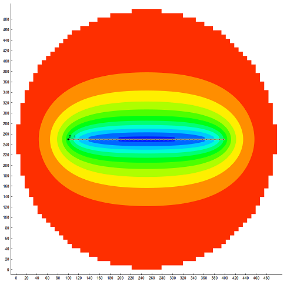

# Скрипты (workflow) создания простых модели скважины

## Simple_well_BHP_control_251_hor

Подходит для версии 25.1 (`api_version=v0_0_207b`)

Создает простую модель горизонтальной скважины с контролем по забойному давлению. 
 
Можно задать форму области дренирования (круглую, прямоугольную), условие на границе (непротекание, поддержание давления).  

Расширен набор переменных workflow которые можно использовать в проектах AHM. Можно задавать размеры области дренирования (скважина автоматически позиционируется в центре), количество ячеек модели по латерали и вертикали. Можно задавать параметры горизонтальной скважины.

## Simple_well_BHP_control_251_frac

Подходит для версии 25.1 (`api_version=v0_0_207b`)

Создает простую модель вертикальной скважины с контролем по забойному давлению. 
 
Можно задать форму области дренирования (круглую, прямоугольную), условие на границе (непротекание, поддержание давления). Можно задать трещину ГРП или вертикальную скважину. 

Расширен набор переменных workflow которые можно использовать в проектах AHM. Можно задавать размеры области дренирования (скважина автоматически позиционируется в центре), количество ячеек модели по латерали и вертикали. Можно задавать параметры трещины ГРП.

## Simple_well_BHP_control_251

Подходит для версии 25.1 (`api_version=v0_0_207b`)

Создает простую модель вертикальной скважины с контролем по забойному давлению. 
 
Можно задать форму области дренирования (круглую, прямоугольную), условие на границе (непротекание, поддержание давления). Можно задать трещину ГРП.
 

## Simple_well_BHP_control

Подходит для версии 25.2 (`api_version=v0_0_231c`)

Создает простую модель вертикальной скважины с контролем по забойному давлению. 
 
Можно задать форму области дренирования (круглую, прямоугольную), условие на границе (непротекание, поддержание давления). Можно задать трещину ГРП.

Для версии 25.2 наблюдаются проблемы с интерфейсом дизайнера моделей при наличии видеокарт АМД. Поэтому рекомендуется использовать версию 25.1 

## Simple_well_THP_control

Подходит для версии 24.4 (`api_version=v0_0_180`)

Создает простую модель вертикальной скважины с контролем по устьевому давлению. Создает проект дизайнера скважины, рассчитывает VFP таблицу. Позволяет построить профиль добычи для фонтанного режима работы. 
Можно задать форму области дренирования (круглую, прямоугольную), условие на границе (непротекание, поддержание давления). Можно задать трещину ГРП.

